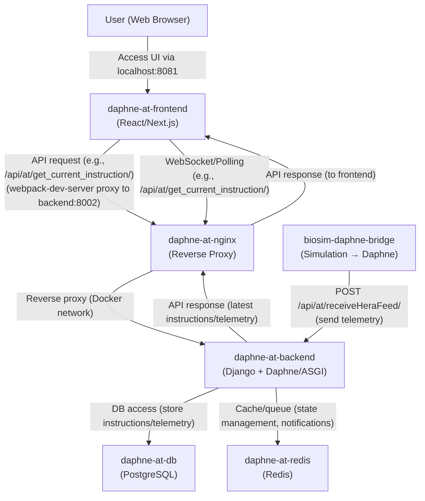

```mermaid
flowchart TD
    USER["User (Web Browser)"]
    FE["daphne-at-frontend<br>(React/Next.js)"]
    NG["daphne-at-nginx<br>(Reverse Proxy)"]
    BE["daphne-at-backend<br>(Django + Daphne/ASGI)"]
    DB["daphne-at-db<br>(PostgreSQL)"]
    RD["daphne-at-redis<br>(Redis)"]
    BR["biosim-daphne-bridge<br>(Simulation → Daphne)"]

    %% User interaction
    USER-->|"Access UI via localhost:8081"|FE
    FE-->|"API request (e.g., /api/at/get_current_instruction/)<br>(webpack-dev-server proxy to backend:8002)"|NG
    NG-->|"Reverse proxy (Docker network)"|BE
    FE-->|"WebSocket/Polling<br>(e.g., /api/at/get_current_instruction/)"|NG

    %% Backend processing
    BE-->|"DB access (store instructions/telemetry)"|DB
    BE-->|"Cache/queue (state management, notifications)"|RD
    BE-->|"API response (latest instructions/telemetry)"|NG
    NG-->|"API response (to frontend)"|FE

    %% Simulation data flow
    BR-->|"POST /api/at/receiveHeraFeed/<br>(send telemetry)"|BE

    classDef cleanBox fill:#ffffff,stroke:#333,stroke-width:1px,color:#000;

    class USER,FE,NG,BE,DB,RD,BR box;
```